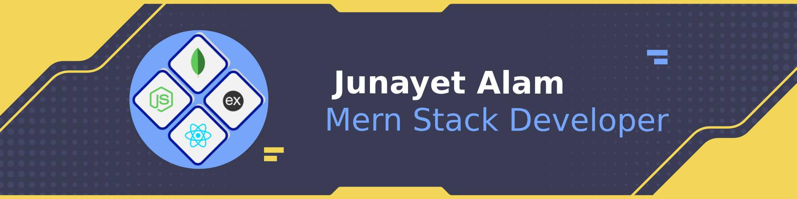

<h1 align="center">Hi, I'm Junayet Alam 👋</h1>

<h3 align="center">Full Stack Developer · Backend-focused (Node.js · TypeScript · PostgreSQL)</h3>

  I build performant, secure and scalable web systems — REST &amp; real-time APIs, multi-tenant SaaS, auth and payment integrations.
  Currently a Full Stack Developer at <a href="https://www.shakiledu.com">Shakil Education Group</a> and a CSE undergrad at Northern University Bangladesh.

  
  
  
  
  

---

## 🚀 About Me

- 🔭 Full Stack Developer at **Shakil Education Group**, building and maintaining a **multi-tenant SaaS** for study-abroad application management.
- 💼 **3+ years** of experience — previously **Backend Developer @ SM Technology** and **Junior Web Developer @ DeveloperLook**.
- 🧩 I specialise in **backend architecture**: REST APIs, real-time systems (WebSocket / Socket.io), authentication, multi-tenancy and payment gateways.
- 🌱 Currently deepening **system design, Redis and performance optimisation**.
- 🎓 **BSc in CSE** @ Northern University Bangladesh (2025 – Present) · **Diploma in Computer Technology**, Feni Polytechnic Institute (CGPA 3.44).
- 📫 Reach me at **junayet.alam@outlook.com** · 📍 Feni / Dhaka, Bangladesh
- ⚡ Fun fact: I love turning complex problems into simple, reliable systems.

---

## 🛠️ Tech Stack

**Languages**

**Frontend**

**Backend**

**Databases**

**Integrations &amp; Cloud**

**DevOps &amp; Tools**

  

---

## 📊 GitHub Stats

  
  

  

  

---

## 📌 Pinned Projects

  
  

  
  

  
  

---

## 📂 Featured Projects — Details

### 💬 Flexi Chat — Login-less Real-Time Chat (PWA)

A production-grade Progressive Web App for anonymous, real-time group chat. Visitors get a guest identity on first load, create or join rooms via invite codes, and message with live presence — no signup required. Includes edit/delete, unread tracking, optimistic send with retry, and layered rate limiting.

- **Live:** [flexi-chat.junayetalam.me](https://flexi-chat.junayetalam.me) · **Code:** [Frontend](https://github.com/JunayetAlam/free-chat-frontend) · [Backend](https://github.com/JunayetAlam/free-chat-backend)
- **Stack:** Next.js 16 · React 19 · TypeScript · Redux Toolkit · WebSocket · PWA · PostgreSQL · Express · Prisma · JWT · Cloudinary

### 📈 Funded For You — Prop-Firm Comparison Marketplace `Team`

A fintech affiliate marketplace where traders discover and compare proprietary trading firms across Forex and Futures — spreads, challenges, offers and best sellers — with a full admin dashboard. Bilingual English/Arabic with automatic RTL support and real-time messaging.

- **Code:** [Frontend](https://github.com/JunayetAlam/funded-for-you-frontend) · [Backend](https://github.com/JunayetAlam/funded-for-you-backend)
- **Stack:** Next.js 16 · React 19 · TypeScript · shadcn/ui · Framer Motion · Node.js · Express · PostgreSQL · Prisma · Stripe · Socket.io · Zod

### 🎓 Kahf Collective — Learning Management System `Team`

A faith-based learning platform combining a full LMS, performance analytics, community forums and a content library. Admins and instructors manage users, courses, assignments and team-based access; students join teams, complete courses and submit assignments for evaluation.

- **Live:** [kahfcollective.vercel.app](https://kahfcollective.vercel.app) · **Code:** [Frontend](https://github.com/JunayetAlam/kahfcollective-frontend) · [Backend](https://github.com/JunayetAlam/kahfcollective-backend)
- **Stack:** Next.js 16 · React 19 · TypeScript · shadcn/ui · dnd-kit · Node.js · Express · MongoDB · Prisma · JWT · Stripe · node-cron

### 🚲 Cycle Craze — E-Commerce Store

A modern, responsive e-commerce frontend for a bicycle store with product browsing, cart, secure checkout and an admin catalog — built on React 19 + Vite with a typed Redux Toolkit data layer and a secure API backend.

- **Live:** [cycle-craze-frontend.vercel.app](https://cycle-craze-frontend.vercel.app) · **Code:** [Frontend](https://github.com/JunayetAlam/cycle-craze-frontend) · [Backend](https://github.com/JunayetAlam/bi-cicle-backend)
- **Stack:** React 19 · TypeScript · Vite · Redux Toolkit · Tailwind CSS · Node.js · Express

<b>🗂️ More projects</b>

- **Zamshed Store** — grocery shop management with Firebase auth, Cloudinary image hosting and JWT-protected APIs · [Frontend](https://github.com/JunayetAlam/zamshed_store_frontend) · [Backend](https://github.com/JunayetAlam/zamshed_store_backend-2.0)
- **Formify** — a faster alternative to Google Forms for building and sharing custom forms · [Live](https://formify-99f7d.web.app/) · [Frontend](https://github.com/JunayetAlam/form-maker) · [Backend](https://github.com/JunayetAlam/form-maker-backend)
- **Blitz Snake** — a browser-based take on the classic Snake game · [Code](https://github.com/JunayetAlam/blitz-snake)

---

## 💼 Experience

| Role | Company | Period |
| --- | --- | --- |
| Full Stack Developer | Shakil Education Group | Feb 2026 – Present |
| Backend Developer | SM Technology | Jun 2025 – Jan 2026 |
| Junior Web Developer | DeveloperLook | Jun 2024 – Jan 2025 |

---

## 🤝 Let's Connect

  
  
  
  

---

<i>Let's build something reliable and scalable together — reach out to collaborate or discuss new ideas.</i>

